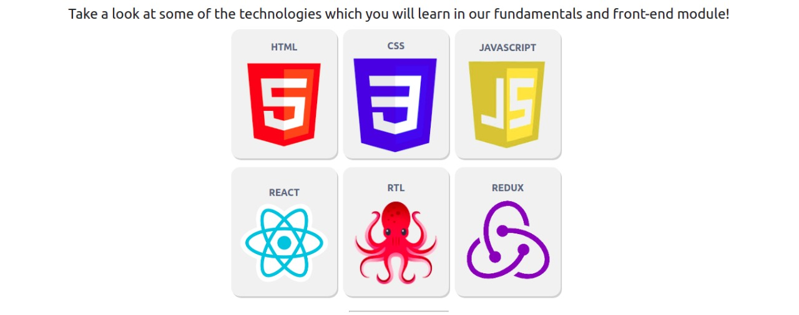

# Boas-vindas ao repositório do exercício Trybe Tech-Gallery

Para realizar o exercício, atente-se a cada passo descrito a seguir e, se tiver qualquer dúvida, nos envie por _Slack_! #vqv 🚀

Aqui você vai encontrar os detalhes de como estruturar o desenvolvimento do seu exercício a partir deste repositório, utilizando uma branch específica e um _Pull Request_ para colocar seus códigos.

# Termos e acordos

Ao iniciar este exercício, você concorda com as diretrizes do Código de Conduta e do Manual da Pessoa Estudante da Trybe.

# Entregáveis

<details>
  <summary><strong>🤷🏽‍♀️ Como entregar</strong></summary><br />

  Para entregar o seu exercício você deverá criar um *Pull Request* neste repositório.

  Lembre-se que você pode consultar nosso conteúdo sobre [Git & GitHub](https://app.betrybe.com/course/4d67f5b4-34a6-489f-a205-b6c7dc50fc16/) e nosso [Blog - Git & GitHub](https://blog.betrybe.com/tecnologia/git-e-github/) sempre que precisar!
</details>

<details>
  <summary><strong>👨‍💻 O que deverá ser desenvolvido</strong></summary><br />

  Você vai desenvolver uma página web utilizando `HTML` e `CSS` com conceitos de *Flexbox*. A página é uma galeria de fotos com algumas linguagens e frameworks front-end.

  💡 Veja no exemplo a seguir como pode ser a aparência do exercício depois de pronto. Você pode, ao final, ir além para deixar o site com sua cara.

  

  <br />

</details>

<details>
  <summary><strong>📝 Habilidades</strong></summary><br />

Nesse Exercício, você será capaz de:

- Criar uma página web utilizando HTML.
- Estilizar sua página utilizando conceitos de CSS Flexbox.
- Utilizar seletores de classes no CSS.
- Utilizar a propriedade `justify-content` com os valores `center`, `flex-start`, `flex-end`, `space-around`, `space-between`, `space-evenly`
- Utilizar a propriedade `align-items` com os valores `stretch`, `center`, `flex-start`, `flex-end`, `baseline`

</details>

# Orientações

<details>
  <summary><strong>‼ Antes de começar a desenvolver</strong></summary><br />

1. Clone o repositório:

- `git clone git@github.com:tryber/sd-030-a-exercise-trybe-tech-gallery.git`.
- Entre na pasta do repositório que você acabou de clonar:
  - `cd sd-030-a-exercise-trybe-tech-gallery`

2. Instale as dependências e inicialize o exercício:

   - Para isso, use o seguinte comando: `npm install`

3. Crie uma branch a partir da branch `main`

- Verifique se você está na branch `main`:
  - Exemplo: `git branch`
- Se não estiver, mude para a branch `main`
  - Exemplo: `git checkout main`
- Agora, crie uma branch onde você vai guardar os `commits` do seu exercício:
  - Você deve criar uma branch no seguinte formato: `nome-sobrenome-nome-do-exercicio`
  - Exemplo: `git checkout -b joao-silva-trybe-tech-gallery`

4. Crie na raiz do exercício os arquivos que você precisará desenvolver:

- Verifique se você está na raiz do exercício

  - Exemplo: `pwd` -> o retorno vai ser algo como _/Users/joao/code/**sd-0x-trybe-tech-gallery**_

- Crie os arquivos `index.html`, `style.css` e `script.js`
  - Exemplo: `touch index.html style.css script.js`

5. Adicione as mudanças ao _stage_ do Git e faça um `commit`

- Verifique que as mudanças ainda não estão em _stage_

  - Exemplo: `git status` (devem aparecer listados os novos arquivos em vermelho)

- Adicione o novo arquivo ao _stage_ do Git

  - Exemplo:
    - `git add .` (adicionando todas as mudanças - _que estavam em vermelho_ - ao stage do Git)
    - `git status` (devem aparecer listados os arquivos em verde)

- Faça o `commit` inicial
  - Exemplo:
    - `git commit -m 'iniciando o exercício. VAMOS COM TUDO :rocket:'` (fazendo o primeiro commit)
    - `git status` (deve aparecer uma mensagem como _nothing to commit_ )

6. Adicione a sua branch com o novo `commit` ao repositório remoto

- Usando o exemplo anterior: `git push -u origin joao-silva-trybe-tech-gallery`

7. Crie um novo `Pull Request` _(PR)_

- Vá até a página de _Pull Requests_ do [repositório no GitHub](https://github.com/tryber/sd-030-a-exercise-trybe-tech-gallery/pulls)
- Clique no botão verde _"New pull request"_
- Clique na caixa de seleção _"Compare"_ e escolha a sua branch **com atenção**
- Coloque um título para a sua _Pull Request_
  - Exemplo: _"Cria tela de busca"_
- Clique no botão verde _"Create pull request"_
- Adicione uma descrição para o _Pull Request_ no seguinte formato: `[Joao Silva] trybe-tech-gallery`, e clique no botão verde _"Create pull request"_
- **Não se preocupe em preencher mais nada por enquanto!**
- Volte até a [página de _Pull Requests_ do repositório](https://github.com/tryber/sd-030-a-exercise-trybe-tech-gallery/pulls) e confira que o seu _Pull Request_ está criado

</details>

<details>
  <summary><strong>⌨️ Durante o desenvolvimento</strong></summary><br />

- Faça `commits` das alterações que você fizer no código regularmente;

- Lembre-se de sempre atualizar o repositório remoto após um (ou alguns) `commits`;

- Os comandos que você utilizará com mais frequência são:

  1. `git status` _(para verificar o que está em vermelho - fora do stage - e o que está em verde - no stage)_;

  2. `git add` _(para adicionar arquivos ao stage do Git)_;

  3. `git commit` _(para criar um commit com os arquivos que estão no stage do Git)_;

  4. `git push -u origin nome-da-branch` _(para enviar o commit para o repositório remoto na primeira vez que fizer o `push` de uma nova branch)_;

  5. `git push` _(para enviar o commit para o repositório remoto após o passo anterior)_.

</details>

<details>
  <summary><strong>🤝 Depois de terminar o desenvolvimento(opcional)</strong></summary><br />

Para sinalizar que o seu exercício está pronto para o _“Code Review”_, faça o seguinte:

- Vá até a página **DO SEU** _Pull Request_, adicione a label de _“code-review”_ e marque seus colegas:

  - No menu à direita, clique no _link_ **“Labels”** e escolha a _label_ **code-review**;
  - No menu à direita, clique no _link_ **“Assignees”** e escolha **o seu usuário**;
  - No menu à direita, clique no _link_ **“Reviewers”** e digite `students`, selecione o time `tryber/students-sd-0x`.

Caso tenha alguma dúvida, [aqui tem um video explicativo](https://vimeo.com/362189205).

⚠️ **Lembre-se que garantir que todas as _issues_ comentadas pelo Linter estão resolvidas!** ⚠️

</details>

<details>
 <summary><strong>🕵🏿 Revisando um pull request</strong></summary><br />

Use o conteúdo sobre [Code Review](https://app.betrybe.com/course/real-life-engineer/code-review) para te ajudar a revisar os _Pull Requests_.

</details>

<details>
  <summary><strong>🎛 Linter</strong></summary><br />

Usaremos o [ESLint](https://eslint.org/) para fazer a análise estática do seu código.

Para garantir a qualidade do código, vamos utilizar neste exercício os linters `ESLint` e `Stylelint`. Assim o código estará alinhado com as boas práticas de desenvolvimento, sendo mais legível e de fácil manutenção!

Para poder rodar o `ESLint` certifique-se de ter executado o comando `npm install` dentro do exercício.

Para rodá-los localmente no exercício, execute os comandos abaixo:

```bash
npm run lint
npm run lint:styles
```

Se a análise do `ESLint` encontrar problemas no seu código, tais problemas serão mostrados no seu terminal. Se não houver problema no seu código, nada será impresso no seu terminal.

Você pode também instalar o plugin do `ESLint` no `VSCode`. Para isso, basta fazer o download do [plugin `ESLint`](https://marketplace.visualstudio.com/items?itemName=dbaeumer.vscode-eslint) e instalá-lo.

Em caso de dúvidas, confira o material na plataforma sobre [ESLint e Stylelint](https://app.betrybe.com/course/real-life-engineer/eslint).

⚠️ **PULL REQUESTS COM ISSUES NO LINTER NÃO SERÃO AVALIADAS. ATENTE-SE PARA RESOLVÊ-LAS ANTES DE FINALIZAR O DESENVOLVIMENTO!** ⚠️

</details>

<details>
  <summary><strong>🛠 Testes</strong></summary><br />
  
Para que os testes sejam executados localmente, verifique se a versão do node na sua máquina é a `16`:

```bash
node -v
```

Caso a versão seja diferente, você pode utilizar o `nvm` para trocar de versão com o seguinte comando:

```bash
nvm use 16
```

Todos os requisitos do exercício serão testados **automaticamente** por meio do `Cypress`.

## Cypress

O Cypress é uma ferramenta de teste de front-end desenvolvida para a web.

Antes de utilizá-lo, certifique-se de ter executado o comando `npm install` dentro do exercício.

Você pode rodar o cypress localmente para verificar se seus requisitos estão passando, para isso execute o um dos seguintes comandos:

Para testar o exercício utilizando apenas o terminal, execute o comando abaixo:

```bash
npm test
```

Para executar os testes e vê-los rodando em uma janela de navegador:

```bash
npm run cypress:open
```

ou

```bash
npx cypress open
```

Após executar um dos dois comandos acima, será aberta uma janela de navegador e então basta clicar no nome do arquivo de teste que quiser executar (project.spec.js).

Você também pode assistir a [este](https://vimeo.com/539240375/a116a166b9) vídeo 😉🎙

## Observações técnicas

Alguns requisitos devem seguir um padrão pré-estabelecido para que os testes automáticos funcionem corretamente, leia-os atentamente e siga à risca o que for pedido. Em particular, **atente-se para os nomes de _classes_ que alguns elementos do seu exercício devem possuir**.

⚠️ **Alguns requisitos pedem para utilizar Flexbox. Tenha atenção no que é solicitado caso vá usar algum framework CSS para que os requisitos sejam atendidos.**

O não cumprimento de um requisito, total ou parcialmente, impactará em sua avaliação.

- Os requisitos do seu exercício são avaliados automaticamente, sendo utilizada a resolução de tela de `1366 x 768` (1366 pixels de largura por 768 pixels de altura).

- ⚠️ Logo, recomenda-se desenvolver seu exercício usando a mesma resolução, via instalação [deste plugin](https://chrome.google.com/webstore/detail/window-resizer/kkelicaakdanhinjdeammmilcgefonfh?hl=en) do `Chrome` para facilitar a configuração da resolução.

- As imagens utilizadas estarão disponíveis para você, mas… caso queira, sinta-se livre para criar a página com a temática que você preferir, nesse caso atente-se para o tamanho das imagens que você utilizará neste exercício. **Não utilize imagens com um tamanho maior que _500Kb_.**

- ⚠️ Utilize uma ferramenta [como esta](https://picresize.com/pt) para redimensionar as imagens.

- Caso a avaliação falhe com alguma mensagem de erro parecida com `[409:0326/130838.878602:FATAL:memory.cc(22)] Out of memory. size=4194304`, provavelmente as imagens que você está utilizando estão muito grandes. Tente redimensioná-las para um tamanho menor.

- Para verificar se a sua avaliação foi computada com sucesso, você pode verificar os **detalhes da execução do avaliador**.

- Na página do seu _Pull Request_, acima do "botão de merge", procure por _**"Evaluator job"**_ e clique no link _**"Details"**_;

- Na página que se abrirá, procure pela linha _**"Cypress evaluator step"**_ e clique nela;

- Analise os resultados a partir da mensagem _**"(Run Starting)"**_;

- Caso tenha dúvidas, consulte [este vídeo](https://vimeo.com/420861252);

- Você tem liberdade para adicionar novos comportamentos ao seu exercício, seja na forma de aperfeiçoamentos em requisitos propostos ou novas funcionalidades, **desde que tais comportamentos adicionais não conflitem com os requisitos propostos**.

- Em outras palavras, você pode fazer mais do que for pedido, mas nunca menos.

- Contudo, tenha em mente que **nada além do que for pedido nos requisitos será avaliado**. _Esta é uma oportunidade de você exercitar sua criatividade e experimentar com os conhecimentos adquiridos._

⚠️ **O avaliador automático não necessariamente avalia seu exercício na ordem em que os requisitos aparecem no readme. Isso acontece para deixar o processo de avaliação mais rápido. Então, não se assuste se isso acontecer, ok?**

</details>

<details>
  <summary><strong>🏗 Estrutura do exercício</strong></summary> <br />

O seu Pull Request deverá conter, obrigatoriamente, os arquivos `index.html` e `style.css`, que conterão seu código HTML e CSS, respectivamente.

As imagens pedidas no exercício estão dentro da pasta `/images`.

⚠️ É importante que seus arquivos tenham exatamente estes nomes!

Caso sinta a necessidade de adicionar outro arquivos além destes, sinta-se à vontade.

</details>

<details>
  <summary><strong>🗂 Compartilhe seu portfólio!</strong></summary><br />

Você sabia que o LinkedIn é a principal rede social profissional e compartilhar o seu aprendizado lá é muito importante para quem deseja construir uma carreira de sucesso? Compartilhe esse exercício no seu LinkedIn, marque o perfil da Trybe (@trybe) e mostre para a sua rede toda a sua evolução.

</details>

# Requisitos Obrigatórios

Não se esqueça de criar os arquivos `index.html` e `style.css`!

⚠️ Lembre-se que o seu projeto só será avaliado se estiver passando por **todos os _checks_** do **Linter**. Utilize o comando `npm run lint:styles` no seu terminal para verificar os _checks_ do **Linter** 😉 ⚠️

## 1. Crie um cabeçalho para sua aplicação utilizando a tag `header`

<details>

<summary> Este Cabeçalho <strong>deve</strong> possuir a classe <code>header-container</code>, ser um <code>flex-container</code> e ter 3 elementos filhos: um <strong>logotipo</strong> com a classe <code>header-img</code>, um <strong>título</strong> com a classe <code>header-img</code> e um <strong>link</strong> de login com a classe <code>header-login</code>. </code>
</summary><br/>

- Observe o exemplo abaixo:

  

**O que será testado:**

- Se existe um cabeçalho na página;
- Se o cabeçalho tem a classe `header-container`;
- Se o cabeçalho é um elemento flex container;
- Se existem três elementos filhos;
- Se existe um elemento `img` com a classe `header-img`;
- Se existe um elemento `h1` com a classe `header-title`;
- Se existe um elemento `a` com a classe `header-login`;
- Se o elemento com a classe `header-title` está no meio do cabeçalho;

</details>

## 2. Implemente o conteúdo da primeira `section`

<details>

<summary> Esta seção deverá conter no mínimo um elemento de texto que deverá ser posicionado utilizando <strong>Flexbox</strong>. </code>
</summary><br/>

- O posicionamento deve ser feito de acordo com o exemplo abaixo:

  

**O que será testado:**

- Se existe uma section com a classe `text-section` na página;
- Se a section é um elemento flex container;
- Se a section tem, no mínimo, um elemento de texto;
- Se o elemento filho é uma tag `p`;

</details>

## 3. Implemente o conteúdo da segunda `section`

<details>

<summary> Esta seção deverá conter no mínimo 6 imagens e um título para cada uma delas que deverão ser posicionados utilizando <strong>Flexbox</strong>. </code>
</summary><br/>

- O posicionamento deve ser feito de acordo com o exemplo abaixo:

  

- Sinta-se livre para usar a imaginação e selecionar as imagens que preferir, só não esqueça de seguir a estrutura de posicionamento proposta.

**O que será testado:**

- Se existe uma section com a classe `gallery` na página;
- Se a section é um elemento flex container;
- Se a section tem, no mínimo, seis elementos filhos (cards com imagens e texto);
- Se cada card é uma section e possui a classe `gallery-card` na página;
- Se cada card tem uma tag `h4` com o respectivo título;
- Se cada card tem uma tag `img` com a respectiva imagem;

</details>

## 4. Crie um rodapé para sua aplicação utilizando a tag `footer`

<details>

<summary> Este rodapé <strong>deve</strong> possuir, no mínimo, 2 elementos e estes devem ser posicionados utilizando <strong>Flexbox</strong>. </code>
</summary><br/>

- Observe o exemplo abaixo:

  

- Você pode fazer com que as imagens redirecionem a pessoa usuária para suas redes sociais.

**O que será testado:**

- Se existe um rodapé na página;
- Se o rodapé tem a classe `footer-container`;
- Se o rodapé é um elemento flex container;
- Se existem, no mínimo, dois elementos filhos;
- Se o elemento `img` com o logo do instagram tem a classe `social-instagram` e possui o atributo src apontando para `./images/instagram-logo.png`;
- Se o elemento `img` com o logo do linkedin tem a classe `social-linkedin` e possui o atributo src apontando para `./images/linked-in-logo.png`

<details>
  <summary>De olho na dica 👀</summary>
  Você pode colocar uma tag <code>img</code> dentro de uma tag <code>a</code>, dessa forma você consegue transformar suas imagens em links clickáveis.
</details>

</details>